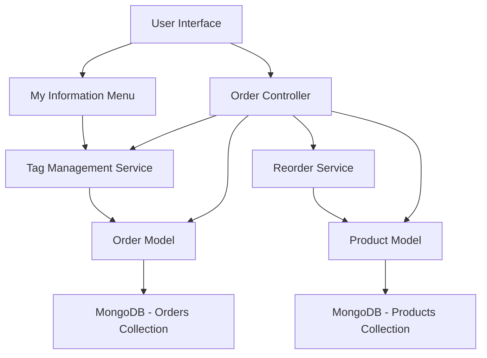
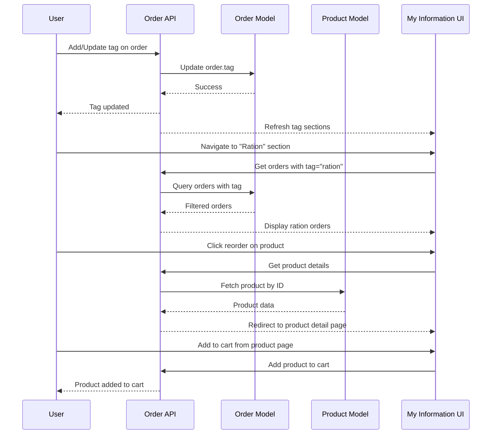

# Design Document: Order Tagging and Reorder

## Overview

This feature enables users to organize their orders using a single custom tag per order (e.g., "ration", "groceries", "monthly") and quickly reorder items from previously tagged orders. Users can create any custom tag name they want, and each unique tag creates a dedicated section in the "My Information" menu. When reordering, users are redirected to the product detail page to review and add items to their cart. This enhances user experience by providing organized access to categorized orders and simplifying repeat purchases.

**Key UI Enhancement**: The "My Information" section dynamically creates new subsections for each unique tag (e.g., "Ration", "Monthly", "Groceries"). Each section displays orders with that specific tag and provides reorder functionality that redirects to product detail pages.

## Architecture



## Main Algorithm/Workflow



## Components and Interfaces

### Component 1: Tag Management Service

**Purpose**: Handles adding, updating, and removing tags from orders (single tag per order)

**Interface**:
```typescript
interface TagManagementService {
  setOrderTag(orderId: string, userId: string, tag: string): Promise<Order>
  removeOrderTag(orderId: string, userId: string): Promise<Order>
  getOrdersByTag(userId: string, tag: string, filters: OrderFilters): Promise<Order[]>
  getUserTags(userId: string): Promise<TagInfo[]>
}

interface TagInfo {
  tagName: string
  orderCount: number
}
```

**Responsibilities**:
- Validate tag format and length
- Ensure user owns the order before modification
- Replace existing tag when new tag is set
- Provide list of all unique tags used by user with order counts

### Component 2: Reorder Service

**Purpose**: Manages reorder functionality by redirecting to product detail pages

**Interface**:
```typescript
interface ReorderService {
  getProductForReorder(productId: string): Promise<Product>
  generateProductDetailUrl(productId: string): string
  validateProductAvailability(productId: string): Promise<boolean>
}

interface Product {
  productId: string
  name: string
  image: string
  currentPrice: number
  isAvailable: boolean
  currentStock: number
  description: string
  vendor: ObjectId
}
```

**Responsibilities**:
- Fetch product details for reorder
- Generate correct product detail page URL
- Validate product availability before redirect
- Handle unavailable products gracefully

### Component 3: My Information Menu Service

**Purpose**: Dynamically generates menu sections based on user's unique tags

**Interface**:
```typescript
interface MyInformationMenuService {
  getUserMenuSections(userId: string): Promise<MenuSection[]>
  getTagSectionOrders(userId: string, tag: string): Promise<Order[]>
}

interface MenuSection {
  sectionId: string
  displayName: string  // e.g., "Ration", "Monthly", "Groceries"
  tagName: string      // e.g., "ration", "monthly", "groceries"
  orderCount: number
  icon?: string
}
```

**Responsibilities**:
- Generate dynamic menu sections for each unique tag
- Calculate order count for each tag section
- Format tag names for display (capitalize first letter)
- Maintain standard sections (My Orders, My Complaints, etc.) alongside tag sections

## Data Models

### Model 1: Order (Extended)

```typescript
interface Order {
  orderId: string
  user: ObjectId
  items: OrderItem[]
  subTotal: number
  taxAmount: number
  deliveryFee: number
  handlingFee: number
  totalAmount: number
  status: OrderStatus
  paymentStatus: PaymentStatus
  paymentMethod: PaymentMethod
  shippingAddress: Address
  vendor: ObjectId
  branchId: ObjectId
  
  // NEW FIELD
  tag?: string  // Single optional tag (1-30 characters)
  
  // Existing fields...
  createdAt: Date
  updatedAt: Date
}
```

**Validation Rules**:
- `tag` is optional (order can have no tag)
- If present, tag must be 1-30 characters
- Tags are case-insensitive and trimmed
- Tags can only contain alphanumeric characters, spaces, and hyphens
- Only ONE tag per order (not an array)

### Model 2: ReorderRequest

```typescript
interface ReorderRequest {
  productId: string  // Single product ID to reorder
  orderId: string    // Original order reference
}
```

**Validation Rules**:
- `productId` must exist and be from the original order
- `orderId` must exist and belong to requesting user
- Product must be available for reorder

## Algorithmic Pseudocode

### Main Reorder Processing Algorithm

```pascal
ALGORITHM processReorderRequest(userId, orderId, productId)
INPUT: userId (UUID), orderId (string), productId (string)
OUTPUT: productDetailUrl (string)

BEGIN
  ASSERT orderId IS NOT NULL
  ASSERT userId IS NOT NULL
  ASSERT productId IS NOT NULL
  
  // Step 1: Fetch and validate original order
  originalOrder ← database.orders.findOne({orderId: orderId, user: userId})
  
  IF originalOrder IS NULL THEN
    THROW Error("Order not found or access denied")
  END IF
  
  // Step 2: Verify product was in original order
  productInOrder ← originalOrder.items.find(item => item.product === productId)
  
  IF productInOrder IS NULL THEN
    THROW Error("Product not found in original order")
  END IF
  
  // Step 3: Fetch current product data
  currentProduct ← database.products.findById(productId)
  
  IF currentProduct IS NULL THEN
    THROW Error("Product no longer available")
  END IF
  
  // Step 4: Generate product detail page URL
  productDetailUrl ← generateProductDetailUrl(productId)
  
  ASSERT productDetailUrl IS NOT NULL
  
  RETURN productDetailUrl
END
```

**Preconditions:**
- userId, orderId, and productId are valid and non-null
- User has permission to access the order
- Database connections are established

**Postconditions:**
- Returns valid product detail page URL
- Product exists in the original order
- Product is available in the system

**Loop Invariants:** N/A (no loops in this algorithm)

### Tag Management Algorithm

```pascal
ALGORITHM setOrderTag(userId, orderId, tag)
INPUT: userId (UUID), orderId (string), tag (string)
OUTPUT: updatedOrder (Order)

BEGIN
  // Validate and sanitize tag
  tag ← sanitizeTag(tag)
  
  IF tag.length < 1 OR tag.length > 30 THEN
    THROW Error("Tag must be between 1 and 30 characters")
  END IF
  
  IF NOT isValidTagFormat(tag) THEN
    THROW Error("Tag contains invalid characters")
  END IF
  
  // Fetch order
  order ← database.orders.findOne({orderId: orderId, user: userId})
  
  IF order IS NULL THEN
    THROW Error("Order not found or access denied")
  END IF
  
  // Set/replace tag (only one tag per order)
  order.tag ← tag
  updatedOrder ← database.orders.save(order)
  
  RETURN updatedOrder
END
```

**Preconditions:**
- userId and orderId are valid
- tag is a non-null string
- User owns the order

**Postconditions:**
- Order has the new tag set (replaces any existing tag)
- Tag is properly sanitized
- Order.tag is a single string value

**Loop Invariants:** N/A (no loops in this algorithm)

### Get User Tags Algorithm

```pascal
ALGORITHM getUserTags(userId)
INPUT: userId (UUID)
OUTPUT: tagInfoList (array of TagInfo)

BEGIN
  ASSERT userId IS NOT NULL
  
  // Aggregate unique tags with counts
  pipeline ← [
    { $match: { user: userId, tag: { $exists: true, $ne: null } } },
    { $group: { 
        _id: { $toLower: "$tag" },
        displayName: { $first: "$tag" },
        count: { $sum: 1 }
      }
    },
    { $sort: { count: -1 } }
  ]
  
  results ← database.orders.aggregate(pipeline)
  
  tagInfoList ← []
  
  FOR each result IN results DO
    tagInfo ← {
      tagName: result.displayName,
      orderCount: result.count
    }
    tagInfoList.add(tagInfo)
  END FOR
  
  RETURN tagInfoList
END
```

**Preconditions:**
- userId is valid and non-null
- Database connection is established

**Postconditions:**
- Returns array of TagInfo objects
- Each TagInfo contains unique tag name and order count
- Results are sorted by order count (descending)
- No duplicate tags in results (case-insensitive)

**Loop Invariants:**
- All processed tags are unique (case-insensitive)
- Order counts are accurate for all processed tags

### Filter Orders by Tag Algorithm

```pascal
ALGORITHM getOrdersByTag(userId, tag, filters)
INPUT: userId (UUID), tag (string), filters (OrderFilters)
OUTPUT: orders (array of Order)

BEGIN
  ASSERT userId IS NOT NULL
  ASSERT tag IS NOT NULL
  
  // Build query
  query ← {
    user: userId,
    tag: { $regex: tag, $options: 'i' }  // Case-insensitive match
  }
  
  // Apply additional filters
  IF filters.status IS NOT NULL THEN
    query.status ← filters.status
  END IF
  
  IF filters.dateFrom IS NOT NULL THEN
    query.createdAt ← { $gte: filters.dateFrom }
  END IF
  
  IF filters.dateTo IS NOT NULL THEN
    IF query.createdAt EXISTS THEN
      query.createdAt.$lte ← filters.dateTo
    ELSE
      query.createdAt ← { $lte: filters.dateTo }
    END IF
  END IF
  
  // Execute query with pagination
  orders ← database.orders.find(query)
    .sort({ createdAt: -1 })
    .limit(filters.limit OR 50)
    .skip(filters.skip OR 0)
    .populate('items.product')
  
  RETURN orders
END
```

**Preconditions:**
- userId is valid and non-null
- tag is a non-empty string
- filters object is valid (may be empty)

**Postconditions:**
- Returns array of orders matching tag and filters
- Orders are sorted by creation date (newest first)
- Results are paginated according to filters
- Product details are populated for each order item

**Loop Invariants:** N/A (database query handles iteration internally)

## Key Functions with Formal Specifications

### Function 1: generateProductDetailUrl()

```typescript
function generateProductDetailUrl(productId: string): string
```

**Preconditions:**
- `productId` is non-null and valid
- Product exists in the system

**Postconditions:**
- Returns valid URL string to product detail page
- URL format: `/products/{productId}` or similar
- No mutations to input parameters

**Loop Invariants:** N/A

### Function 2: sanitizeTag()

```typescript
function sanitizeTag(tag: string): string
```

**Preconditions:**
- `tag` is a string (may be empty or contain whitespace)

**Postconditions:**
- Returns trimmed string with normalized whitespace
- Multiple consecutive spaces replaced with single space
- Leading and trailing whitespace removed
- Special characters except hyphens and spaces are removed
- Result is lowercase for consistency

**Loop Invariants:** N/A

### Function 3: validateProductAvailability()

```typescript
function validateProductAvailability(productId: string): boolean
```

**Preconditions:**
- `productId` is a valid string

**Postconditions:**
- Returns boolean indicating if product is available
- `true` if and only if product exists and is in stock
- No mutations to product data

**Loop Invariants:** N/A

## Example Usage

```typescript
// Example 1: Set tag on order (replaces any existing tag)
const order = await setOrderTag(userId, orderId, "ration")
console.log(order.tag) // "ration"

// Example 2: Change tag on order
const updatedOrder = await setOrderTag(userId, orderId, "monthly")
console.log(updatedOrder.tag) // "monthly" (replaced "ration")

// Example 3: Remove tag from order
const orderWithoutTag = await removeOrderTag(userId, orderId)
console.log(orderWithoutTag.tag) // undefined

// Example 4: Get orders by tag
const rationOrders = await getOrdersByTag(userId, "ration", {
  status: "delivered",
  limit: 20
})

// Example 5: Get user's all tags with counts
const userTags = await getUserTags(userId)
console.log(userTags)
// [
//   { tagName: "ration", orderCount: 12 },
//   { tagName: "monthly", orderCount: 8 },
//   { tagName: "groceries", orderCount: 5 }
// ]

// Example 6: Reorder a product from an order
const productId = order.items[0].product
const productUrl = await processReorderRequest(userId, orderId, productId)
console.log(productUrl) // "/products/64a5f3b2c8e9d1234567890a"
// User is redirected to product detail page

// Example 7: Get My Information menu sections
const menuSections = await getUserMenuSections(userId)
console.log(menuSections)
// [
//   { sectionId: "my-orders", displayName: "My Orders", ... },
//   { sectionId: "my-complaints", displayName: "My Complaints", ... },
//   { sectionId: "tag-ration", displayName: "Ration", tagName: "ration", orderCount: 12 },
//   { sectionId: "tag-monthly", displayName: "Monthly", tagName: "monthly", orderCount: 8 },
//   { sectionId: "saved-addresses", displayName: "Saved Addresses", ... }
// ]

// Example 8: Get orders for a tag section
const rationSectionOrders = await getTagSectionOrders(userId, "ration")
console.log(`Found ${rationSectionOrders.length} orders in Ration section`)
```

## Correctness Properties

*A property is a characteristic or behavior that should hold true across all valid executions of a system—essentially, a formal statement about what the system should do. Properties serve as the bridge between human-readable specifications and machine-verifiable correctness guarantees.*

### Property 1: Tag Setting Persistence

*For any* valid tag and order owned by a user, setting the tag on the order should result in the tag being present in the order's tag field (replacing any previous tag).

**Validates: Requirements 1.1**

### Property 2: Tag Length Validation

*For any* string, if its length is less than 1 or greater than 30 characters, attempting to set it as a tag should be rejected with a validation error.

**Validates: Requirements 1.2, 12.2**

### Property 3: Tag Character Validation

*For any* string containing characters other than alphanumeric, spaces, or hyphens, attempting to set it as a tag should be rejected with a validation error.

**Validates: Requirements 1.3, 12.3**

### Property 4: Tag Replacement

*For any* order with an existing tag, setting a new tag should replace the existing tag (not add to an array).

**Validates: Requirements 1.1**

### Property 5: Tag Sanitization

*For any* tag string with leading/trailing whitespace or multiple consecutive spaces, the sanitized tag should have whitespace trimmed and normalized to single spaces.

**Validates: Requirements 1.6**

### Property 6: Tag Removal

*For any* order with a tag, removing the tag should result in the tag field being null or undefined.

**Validates: Requirements 1.7**

### Property 7: Tag-Based Order Filtering

*For any* tag and set of orders, filtering orders by that tag should return exactly those orders containing the tag (case-insensitive) and no orders without the tag.

**Validates: Requirements 2.1, 3.4, 8.3**

### Property 8: Filtered Order Sorting

*For any* set of filtered orders, the results should be sorted by creation date in descending order (newest first).

**Validates: Requirements 2.2**

### Property 9: Pagination Limit Enforcement

*For any* page size parameter, the number of returned results should not exceed the specified page size.

**Validates: Requirements 2.3**

### Property 10: Compound Filter Accuracy

*For any* tag and status filter combination, all returned orders should match both the tag and the status criteria.

**Validates: Requirements 2.4**

### Property 11: Date Range Filter Accuracy

*For any* date range filter, all returned orders should have creation dates within the specified range (inclusive).

**Validates: Requirements 2.5**

### Property 12: Tag Count Accuracy

*For any* tag used by a user, the displayed count should equal the actual number of orders containing that tag.

**Validates: Requirements 2.6, 3.5**

### Property 13: Unique Tag Set Completeness

*For any* user, requesting their tags should return a set containing all unique tags (case-insensitive) used across their orders with no duplicates.

**Validates: Requirements 3.1**

### Property 14: Tag Order Count Display

*For any* user with tags, the system should display each tag with its order count in the My Information menu.

**Validates: Requirements 3.2**

### Property 15: Product Detail URL Generation

*For any* valid product ID from a reorder request, the system should generate a valid product detail page URL.

**Validates: Requirements 4.1**

### Property 16: Product Availability Check

*For any* product in a reorder request, the system should verify the product exists and is available before generating the redirect URL.

**Validates: Requirements 4.4, 4.5**

### Property 17: Reorder Product Validation

*For any* reorder request, the system should verify the product was in the original order before allowing the reorder.

**Validates: Requirements 5.1**

### Property 18: Product Detail Redirect

*For any* successful reorder request, the user should be redirected to the product detail page (not cart or checkout).

**Validates: Requirements 5.2**

### Property 19: Order Ownership Verification

*For any* tag modification or reorder operation, the system should verify that the user owns the order before allowing the operation to proceed.

**Validates: Requirements 7.1, 7.2, 7.3**

### Property 20: Unauthorized Access Rejection

*For any* attempt to access an order not owned by the requesting user, the system should return an access denied error.

**Validates: Requirements 7.4**

### Property 21: Unauthorized Access Logging

*For any* unauthorized access attempt, the system should log the attempt with relevant details for security auditing.

**Validates: Requirements 7.5**

### Property 22: Order Detail Tag Display

*For any* order in the detail view, the tag should be displayed with an edit/remove button.

**Validates: Requirements 8.4**

### Property 23: Tag Autocomplete

*For any* user editing a tag in order details, the autocomplete suggestions should include all of the user's existing tags.

**Validates: Requirements 8.6**

### Property 24: Dynamic Menu Section Creation

*For any* unique tag used by a user, a corresponding section should appear in the My Information menu.

**Validates: Requirements 9.1**

### Property 25: Tag Section Order Display

*For any* tag section in My Information, clicking it should display all orders with that specific tag.

**Validates: Requirements 9.2**

### Property 26: Reorder Button Product Redirect

*For any* product reorder button clicked in a tag section, the user should be redirected to that product's detail page.

**Validates: Requirements 9.3**

### Property 27: Touch-Friendly UI Sizing

*For any* interactive element in the UI, the touch target size should be at least 44x44 pixels to ensure mobile accessibility.

**Validates: Requirements 10.5**

### Property 28: Single Tag Constraint

*For any* order in the system, the order should have at most one tag (not an array of tags).

**Validates: Requirements 12.1**

### Property 29: Non-Negative Monetary Values

*For any* price calculation in the system, all monetary values should be non-negative.

**Validates: Requirements 12.5**

### Property 30: Product Availability Validation

*For any* reorder request, the system should validate that the product is available before generating the redirect URL.

**Validates: Requirements 12.6**

### Property 31: Error Logging

*For any* error that occurs in the system, the error details should be logged for debugging purposes.

**Validates: Requirements 13.7**

### Property 32: Rate Limit Violation Logging

*For any* rate limit violation, the system should log the violation with user and timestamp information for monitoring purposes.

**Validates: Requirements 14.4**

## Error Handling

### Error Scenario 1: Order Not Found

**Condition**: User attempts to set tag or reorder from non-existent order
**Response**: Return 404 error with message "Order not found"
**Recovery**: User should verify order ID and try again

### Error Scenario 2: Unauthorized Access

**Condition**: User attempts to modify or reorder from another user's order
**Response**: Return 403 error with message "Access denied"
**Recovery**: System logs attempt, user is redirected to their orders

### Error Scenario 3: Product Unavailable

**Condition**: During reorder, the selected product is out of stock or no longer exists
**Response**: Return 400 error with message "Product is currently unavailable"
**Recovery**: Display message to user, suggest browsing similar products

### Error Scenario 4: Invalid Tag Format

**Condition**: User provides tag with invalid characters or length
**Response**: Return 400 error with specific validation message
**Recovery**: Display validation rules and allow user to correct input

### Error Scenario 5: Product Not in Original Order

**Condition**: User attempts to reorder a product that wasn't in the original order
**Response**: Return 400 error with message "Product not found in original order"
**Recovery**: User should select a valid product from the order

## Testing Strategy

### Unit Testing Approach

**Key Test Cases**:
1. Tag validation (length, format, single tag per order)
2. Tag setting and replacement logic
3. Product URL generation
4. Tag-based order filtering
5. Authorization checks for order access
6. Tag sanitization edge cases

**Coverage Goals**: 90% code coverage for all service functions

**Test Framework**: Jest with MongoDB Memory Server for isolated tests

### Property-Based Testing Approach

**Property Test Library**: fast-check (JavaScript/TypeScript)

**Properties to Test**:

1. **Tag Uniqueness Property**
   - Generate random tag strings
   - Verify only one tag per order after setting
   - Test with various Unicode characters

2. **Tag Replacement Property**
   - Generate two different tags
   - Set first tag, then set second tag
   - Verify second tag replaces first (not added to array)

3. **URL Generation Determinism**
   - Generate product IDs
   - Verify URL generation is deterministic
   - Same input always produces same output

4. **Tag Sanitization Idempotency**
   - Generate random strings with whitespace
   - Verify sanitizing twice produces same result as sanitizing once

5. **Order Filtering Correctness**
   - Generate random orders with tags
   - Verify filtered results contain only orders with specified tag
   - Test case-insensitive matching

### Integration Testing Approach

**Test Scenarios**:
1. End-to-end tag setting and order filtering
2. Complete reorder flow from button click to product page redirect
3. Dynamic My Information menu section generation
4. Concurrent tag updates on same order
5. Tag-based order filtering with pagination
6. Product availability validation during reorder

**Test Environment**: Staging database with realistic test data

## Performance Considerations

### Database Indexing
- Add index on `Order.tag` field for efficient tag-based queries
- Compound index on `{user: 1, tag: 1, createdAt: -1}` for filtered queries
- Ensure Product model has index on `_id` for reorder lookups

### Query Optimization
- Use projection to fetch only required fields during product lookups
- Implement pagination for tag-based order listing (default 50 items)
- Cache user tag lists with 5-minute TTL

### Response Time Targets
- Tag setting/removal: < 200ms
- Order filtering by tag: < 500ms
- Product URL generation: < 100ms
- My Information menu generation: < 300ms

### Scalability Considerations
- Implement rate limiting: 10 tag operations per minute per user
- Use efficient aggregation pipeline for getUserTags
- Consider Redis caching for popular tag queries

## Security Considerations

### Authorization
- Verify user ownership before any order modification
- Implement JWT-based authentication for all endpoints
- Use role-based access control (users can only access their own orders)

### Input Validation
- Sanitize all tag inputs to prevent XSS attacks
- Validate order IDs to prevent NoSQL injection
- Limit tag length to prevent database bloat

### Data Privacy
- Do not expose other users' tags or order patterns
- Log all reorder attempts for audit trail
- Implement rate limiting to prevent abuse

### API Security
- Use HTTPS for all endpoints
- Implement CSRF protection for state-changing operations
- Add request signing for sensitive operations

## Dependencies

### External Libraries
- **mongoose**: MongoDB ODM for data modeling (already in use)
- **express**: Web framework for API endpoints (already in use)
- **express-validator**: Input validation middleware (recommended)

### Internal Services
- **Product Service**: Fetch product details and availability
- **Order Service**: Manage orders (already exists)
- **User Service**: Verify user authentication and authorization (already exists)

### Database
- **MongoDB**: Primary database for orders and products (already in use)
- **Redis** (optional): Caching layer for frequently accessed data

### API Endpoints Required

**New Endpoints**:
1. `PUT /api/orders/:orderId/tag` - Set/update tag on order
2. `DELETE /api/orders/:orderId/tag` - Remove tag from order
3. `GET /api/orders/by-tag/:tag` - Get orders filtered by tag
4. `GET /api/orders/:orderId/reorder/:productId` - Get product detail URL for reorder
5. `GET /api/users/tags` - Get all unique tags used by user with counts
6. `GET /api/users/menu-sections` - Get My Information menu sections (including dynamic tag sections)
7. `GET /api/users/tag-section/:tag` - Get orders for a specific tag section

**Modified Endpoints**:
- `GET /api/orders/:orderId` - Include tag in response
- `GET /api/orders` - Add tag filter parameter

## UI/UX Design Specifications

### My Information Section Enhancement

**Location**: User Profile → My Information

**New UI Structure**:

The "My Information" section dynamically generates menu items based on user's unique tags. Each tag creates a dedicated section alongside standard sections.

**Menu Structure Example**:
```
My Information
├── My Orders (standard)
├── My Complaints (standard)
├── Ration (dynamic - from tag "ration")
├── Monthly (dynamic - from tag "monthly")
├── Groceries (dynamic - from tag "groceries")
└── Saved Addresses (standard)
```

**Dynamic Tag Section Behavior**:
1. When user tags an order with "ration", a "Ration" section appears in My Information menu
2. Clicking "Ration" section shows all orders tagged with "ration"
3. Each unique tag creates its own section
4. Section names are capitalized versions of tag names
5. Sections show order count badge: "Ration (12)"

### Tag Section Order Display

**Components**:

1. **Section Header**:
   - Title: "[Tag Name]" (e.g., "Ration", "Monthly")
   - Subtitle: "X orders" count
   - Optional: Last order date

2. **Order Cards**:
   - Each order displayed as a card
   - Order number, date, total amount
   - Product thumbnails (first 3-4 products)
   - Order status badge

3. **Product Reorder Buttons**:
   - Each product in the order has a "Reorder" button
   - Clicking redirects to product detail page
   - Button shows product name and thumbnail
   - Disabled if product unavailable (grayed out with "Unavailable" text)

### Order Detail Page Tag Management

**Location**: Order Detail Page

**Tag Management UI**:

1. **Tag Display Section**:
   - Located near order header
   - Shows current tag as a badge (if exists)
   - "Edit Tag" button next to badge
   - If no tag: "Add Tag" button

2. **Tag Edit Modal/Dropdown**:
   - Input field with autocomplete
   - Autocomplete shows user's existing tags
   - "Save" and "Cancel" buttons
   - "Remove Tag" button (if tag exists)

3. **Tag Input Behavior**:
   - Autocomplete suggestions appear as user types
   - Can select from existing tags or create new one
   - Real-time validation (1-30 characters, valid characters only)
   - Error messages displayed inline

### Reorder Button Behavior

**Location**: Tag section order cards

**Button Appearance**:
- "Reorder" button on each product in the order
- Product thumbnail + name + "Reorder" icon
- Availability indicator (green checkmark or gray "Unavailable")

**Click Behavior**:
1. User clicks "Reorder" on a product
2. System validates product availability
3. If available: Redirect to product detail page
4. If unavailable: Show toast message "Product currently unavailable"
5. Product detail page URL: `/products/{productId}`

### Mobile Responsive Design

- Tag sections stack vertically in My Information menu
- Order cards adapt to mobile width
- Reorder buttons remain touch-friendly (44x44px minimum)
- Tag edit modal becomes full-screen on mobile
- Swipe gestures to navigate between tag sections

### Visual Design Guidelines

**Colors**:
- Tag badge: Light gray background (#F5F5F5) with dark text
- Active section: Primary brand color highlight
- Reorder button: Primary brand color
- Unavailable indicator: Gray (#9E9E9E)

**Typography**:
- Section titles: 18px, bold
- Tag badge: 12px, medium weight
- Order card text: 14px, regular
- Product names: 14px, medium weight

**Spacing**:
- Section padding: 16px
- Order cards: 12px margin between each
- Tag badge: 8px padding
- Reorder buttons: 8px margin

**Icons**:
- Tag icon: Label/tag outline icon
- Reorder icon: Refresh/repeat icon or arrow-right
- Unavailable: X or slash icon
- Edit tag: Pencil icon
